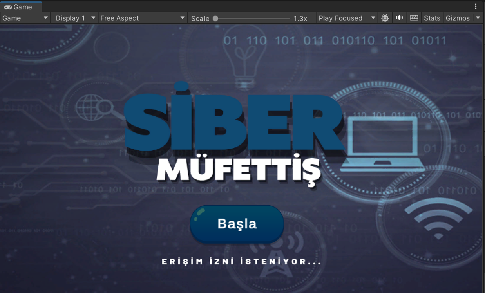
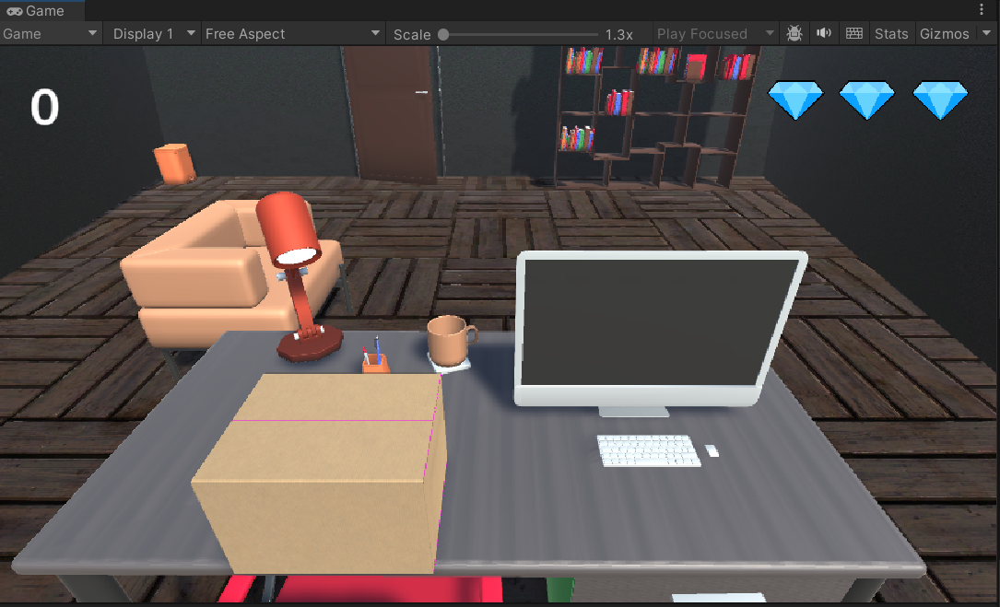
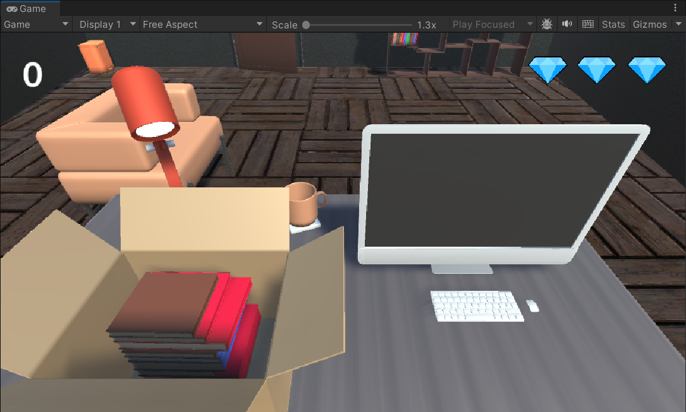
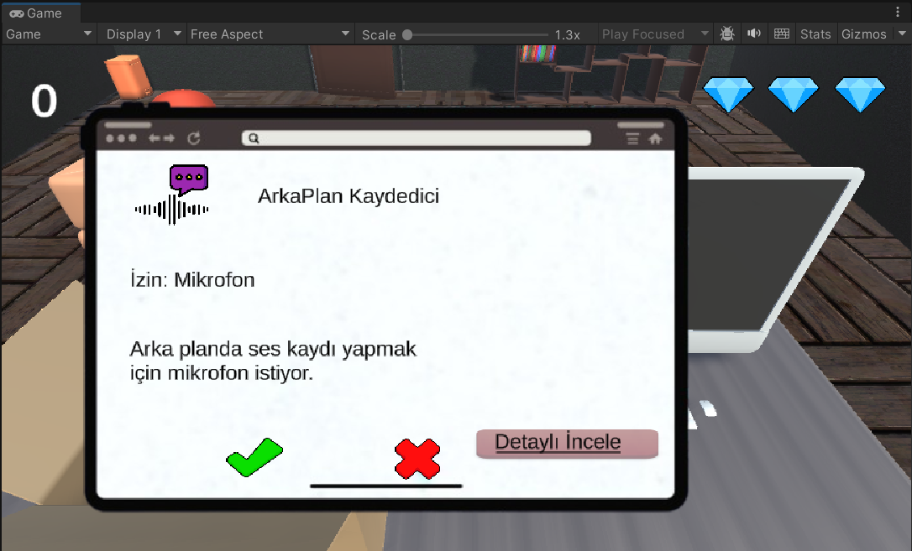
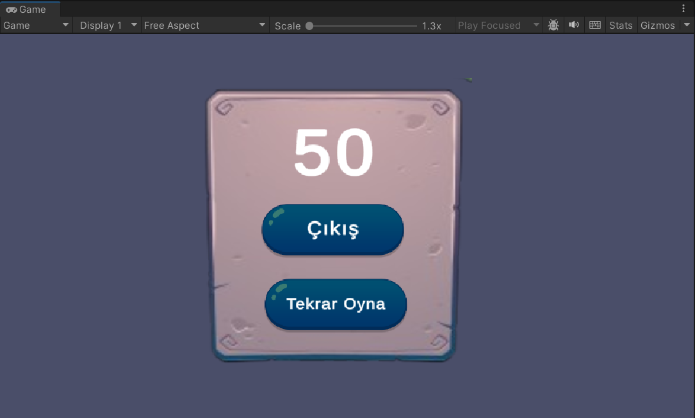

# Siber Müfettiş
Kullanıcının farklı uygulama senaryolarında “İzin Ver / Reddet” kararı verdiği, doğru kararlarla puan topladığı, hatalarda can kaybettiği eğitsel bir mini oyun.

## Amaç
Kullanıcılara, mobil uygulama izinleri konusunda farkındalık kazandırmak ve doğru karar verme alışkanlığı geliştirmek.

## Oynanış
Başla butonuna basarak oyuna girilir.
Masadaki kutuyu açıp kitaba tıklayınca tablet ekranı açılır.
Tablette uygulama adı, açıklama ve istediği izin görüntülenir.
Doğru karar puan kazandırır.
Yanlış karar can kaybetirir.

## Teknolojileer
-Unity , C#

## Ekran Görüntüleri

## YouTube
https://youtu.be/zNTaseVueHg
